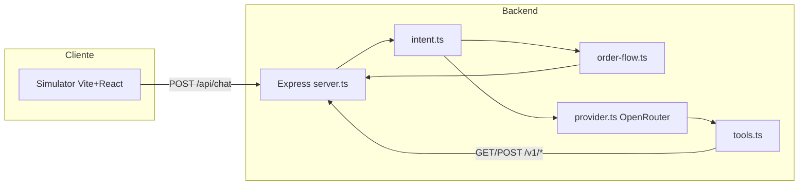

# AltraFlow

Assistente virtual da AltraFlow para consulta de estoque, pedidos e financeiro. Utiliza LLM (OpenRouter, API compatível com OpenAI) para conversa e fluxo de pedido em código (state machine) para confirmação e criação de pedidos.

## Stack

- **Backend:** Node.js, TypeScript, Express
- **Persistência:** Drizzle ORM + Postgres (opcional via `POSTGRES_URL`)
- **Sessões/cache:** Redis (Vercel KV/Upstash) opcional via `KV_REST_API_URL` e `KV_REST_API_TOKEN`
- **IA:** OpenRouter (cliente OpenAI), modelo configurável via `OPENROUTER_MODEL`
- **Frontend (simulador):** Vite, React, Tailwind CSS
- **Testes:** Jest, ts-jest, supertest

## Estrutura do projeto

```
AltraFlow/
├── src/
│   ├── mock/           # Servidor Express (API mock + rota /api/chat)
│   │   ├── server.ts    # Entrada do servidor
│   │   ├── app.ts       # App enxuto para testes
│   │   └── data.ts      # Dados mock compartilhados
│   ├── core/
│   │   ├── ai/          # Lógica do assistente
│   │   │   ├── provider.ts   # Chamadas OpenRouter + loop de tools
│   │   │   ├── tools.ts      # Ferramentas (estoque, cliente, títulos, pedidos)
│   │   │   ├── intent.ts     # Detecção de intenção (regex/keywords)
│   │   │   ├── order-flow.ts # State machine do fluxo de pedido
│   │   │   └── SYSTEM_PROMPT.md
│   │   └── utils/       # Formatação e helpers
│   └── __tests__/       # Testes Jest
├── simulator/           # UI do chat (Vite + React)
├── .env.example
├── .env.local            # Variáveis de ambiente (não versionado)
└── package.json
```

## Pré-requisitos

- Node.js 18+
- Conta no [OpenRouter](https://openrouter.ai) e chave de API

## Como rodar

### 1. Variáveis de ambiente

Copie o exemplo e preencha a chave da OpenRouter:

```bash
cp .env.example .env.local
```

Edite `.env.local` e defina pelo menos:

- `OPENROUTER_API_KEY` — chave da API OpenRouter
- Opcional: `OPENROUTER_MODEL` (padrão: `google/gemini-2.5-flash-lite`)
- Opcional: `POSTGRES_URL` para persistir dados em banco
- Opcional: `KV_REST_API_URL` e `KV_REST_API_TOKEN` para sessão em Redis

### Configuração por cliente

Sem arquivo de config, o sistema usa **defaults** (AltraFlow, localhost:3000, `SYSTEM_PROMPT.md`). Para personalizar por cliente:

1. **Arquivo:** copie `config/tenant.example.json` para `config/tenant.json` e edite.
2. **Variáveis de ambiente** (opcional; sobrescrevem o arquivo): `API_BASE_URL`, `ASSISTANT_NAME`, `COMPANY_NAME`, `SYSTEM_PROMPT_PATH`.
3. **Como adicionar um novo cliente:** edite `config/tenant.json` com o nome da empresa e a `api.baseUrl` do ERP do cliente. Para persona/tom próprio, crie `config/prompts/meu-cliente.md` e em `tenant.json` defina `prompt.systemPromptPath`: `"config/prompts/meu-cliente.md"`.

### 2. Backend (API + chat)

Na raiz do projeto:

```bash
npm install
npm run dev
```

O servidor sobe em **http://localhost:3000** (API mock em `/v1/*` e chat em `POST /api/chat`).

### 3. Simulador (interface do chat)

Em outro terminal:

```bash
cd simulator
npm install
npm run dev
```

Acesse a URL exibida pelo Vite (ex.: http://localhost:5173) e converse com o assistente.

## Arquitetura do chat



1. **Intent** classifica a mensagem (saudação, estoque, pedido, “quero N unidades”, confirmar, negar, etc.).
2. Se houver **fluxo de pedido ativo** e o intent não for consulta de estoque, a **order flow** (state machine) responde.
3. Se o intent for **START_ORDER** ou **START_ORDER_WITH_QUANTITY** e existir produto do último estoque consultado, a **order flow** inicia ou continua o pedido.
4. Saudações e pedido de atendente humano têm respostas fixas.
5. Demais casos vão para o **LLM** (OpenRouter) com ferramentas (consultar estoque, cliente, títulos, pedidos).

## Fluxo recomendado de pedido

1. **Consultar produto** — ex.: “qual o preço do PROD-008?” ou “tem cimento?”
2. **Informar quantidade** — “quero 2 unidades” ou “sim quero 2 unidades do produto”
3. **Informar CPF ou CNPJ** — quando o assistente pedir
4. **Confirmar** — “sim” para fechar o pedido (o sistema chama `POST /v1/vendas/pedido` e exibe o número do pedido)

Se a quantidade já tiver sido dita (ex.: “sim quero 2 unidades”), o assistente pede só o CPF/CNPJ e em seguida a confirmação.

## Clientes de teste (mock)

| Documento       | Nome                 | Status    |
|-----------------|----------------------|-----------|
| 12345678000190  | Mercadinho do João   | ativo     |
| 98765432000100  | Pão Quente           | bloqueado |
| 11122233000144  | Silva Materiais      | inativo   |
| 55566677000188  | Horizonte Engenharia | ativo     |
| 52998224725     | José F. Silva (CPF)  | ativo     |
| 33344455000166  | Depósito Central     | bloqueado |

## Simulador e produção

O **simulador** (interface web com Vite) serve para o cliente **testar, validar e dar OK** antes de ir para produção. Em **produção** o assistente **não** é usado via web: ele se conecta a uma **API de mensageria** (ex.: WhatsApp Business via SouChat ou similar). A plataforma envia as mensagens dos usuários para o nosso backend via **webhook**; o backend processa e devolve a resposta; a mensageria entrega no WhatsApp.

### Produção (WhatsApp)

1. Configure na plataforma de mensageria a **URL do webhook**: `https://<seu-backend>/webhook/messages`
2. Defina no `.env` o `WEBHOOK_SECRET` ou `SOUCHAT_WEBHOOK_SECRET` para validação de assinatura (recomendado).
3. O endpoint `POST /webhook/messages` espera no body: `phone` (ou `from`/`sender_id`) e `message` (ou `text`/`content`). Responde com `{ reply: string }`. Consulte a documentação da sua API de mensageria para o formato exato.

## Administração (projetos e agentes)

É possível gerenciar **empresas (tenants)** e **múltiplos agentes de IA** por empresa sem editar arquivos à mão.

### Chave de admin

- Defina no `.env.local` a variável **`ADMIN_API_KEY`** (uma string secreta, ex.: um token longo).
- Se `ADMIN_API_KEY` estiver vazia ou não definida, as rotas de admin ficam **desabilitadas** (retornam 401).
- Quem conhece a chave pode usar o **painel web** ou a **API REST** para criar/editar empresas e agentes.

### Painel web

1. No simulador (Vite), acesse **Admin** no menu e abra `/admin`.
2. Na primeira vez, informe a **chave de admin** (o valor de `ADMIN_API_KEY`) e clique em **Acessar**.
3. A chave é armazenada em **sessionStorage** apenas na sessão do navegador (não é enviada ao servidor além do header nas requisições).
4. A partir daí você pode listar empresas, criar novas, editar uma empresa (nome, URL da API, etc.) e, dentro de cada uma, **criar/editar/remover agentes** (id, nome, prompt — path ou texto —, modelo OpenRouter).

### API REST (admin)

Todas as rotas abaixo exigem o header **`X-Admin-Key`** (ou `Authorization: Bearer <chave>`) com o valor de `ADMIN_API_KEY`.

| Método | Rota | Descrição |
|--------|------|-----------|
| GET | `/api/admin/tenants` | Lista IDs dos tenants |
| GET | `/api/admin/tenants/:id` | Detalhe do tenant (config + assistentes) |
| POST | `/api/admin/tenants` | Cria tenant (body: `id`, `branding`, `api`, `features`, `assistants[]`) |
| PATCH | `/api/admin/tenants/:id` | Atualiza tenant |
| DELETE | `/api/admin/tenants/:id` | Remove tenant (arquivo em `config/tenants/{id}.json`) |

A persistência é em arquivo: **`config/tenant.json`** (tenant default) e **`config/tenants/{tenantId}.json`** para os demais.

### Ferramentas (Tools) via painel

O sistema permite **criar**, **vincular a agentes** e **testar o retorno** das ferramentas (tools) usadas pelo assistente de IA.

1. **Criação de Tools via painel**
   - No painel, abra uma empresa e clique em **Ferramentas** (ou acesse `/empresas/:id/tools`).
   - Use **Nova ferramenta** para criar uma tool custom: defina **ID**, **Nome** (para o LLM), **Descrição**, **Parâmetros** (JSON Schema) e **Execução** (built-in existente ou HTTP com URL e método GET/POST).
   - As tools built-in (`consultar_cliente`, `consultar_titulos`, `consultar_pedidos`, `consultar_estoque`) aparecem na lista e não podem ser editadas/removidas; só tools custom podem ser criadas, editadas e excluídas.

2. **Vínculo ao agente**
   - Na página de **detalhe do agente** (Configurações), na seção **Ferramentas**, marque as tools que este agente pode usar.
   - Use o link **Gerenciar ferramentas** para ir ao painel de tools da empresa sem sair do contexto.
   - Se nenhuma tool for selecionada, o sistema usa o comportamento padrão (por recursos: financeiro, pedido, etc.).

3. **Teste de retorno**
   - Na página de Ferramentas da empresa, cada tool tem um botão **Testar**.
   - No modal, preencha os parâmetros (quando houver) e clique em **Executar**.
   - O retorno é exibido com indicação visual de **sucesso** (verde) ou **erro** (vermelho), permitindo validar a tool antes de usá-la no agente.

**API REST (tools):** Todas com header `X-Admin-Key` (ou `Authorization: Bearer <chave>`).

| Método | Rota | Descrição |
|--------|------|-----------|
| GET | `/api/admin/tenants/:id/tools` | Lista tools do tenant (built-ins + custom) |
| POST | `/api/admin/tenants/:id/tools` | Adiciona tool custom (body: `{ tool: { id, name, description, parameters, execution } }`) |
| PATCH | `/api/admin/tenants/:id/tools/:toolId` | Atualiza tool custom |
| DELETE | `/api/admin/tenants/:id/tools/:toolId` | Remove tool custom |
| POST | `/api/admin/tenants/:id/tools/:toolId/test` | Executa a tool com `{ args }` e retorna `{ output }` (ou 500 com `{ error }`) |

### Chat e webhook com agente

No **chat** (`POST /api/chat`) e no **webhook** (`POST /webhook/messages`) é possível enviar, além do `tenant_id`, um **`assistant_id`** (no body ou header/query) para escolher qual agente da empresa atende. As sessões são separadas por (tenant, assistente, telefone).

## Testes

Na raiz do projeto:

```bash
npm run test
```

Scripts úteis: `npm run test:watch`, `npm run test:coverage`.

## Scripts principais (raiz)

| Script   | Comando                    | Descrição              |
|----------|----------------------------|------------------------|
| `dev`    | `ts-node src/mock/server.ts` | Sobe API + chat        |
| `start`  | idem                       | Idem                   |
| `build`  | `tsc`                      | Compila TypeScript     |
| `db:migrate` | `node scripts/db-migrate.js` | Aplica migrations SQL no Postgres |
| `db:migrate:json` | `ts-node scripts/migrate-json-to-db.ts` | Migra tenants/agentes de JSON para Postgres |
| `vercel:bootstrap:storage` | `node scripts/vercel-bootstrap-storage.js` | Bootstrap Vercel/integrations sem prompt |
| `vercel:deploy:ci` | `node scripts/vercel-deploy-ci.js` | Pipeline não-interativo (bootstrap+migrate+deploy) |
| `test`   | `jest`                     | Roda os testes         |
